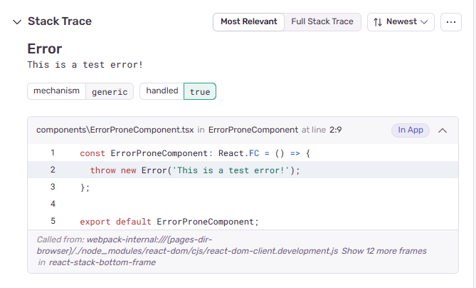

This app illustrates the concept of using graphql to fetch API requests with a simple UI for display.
Concepts applied: 
## iterface and props
## graphql
## components
## Setting An Error Using Sentry Dashboard

